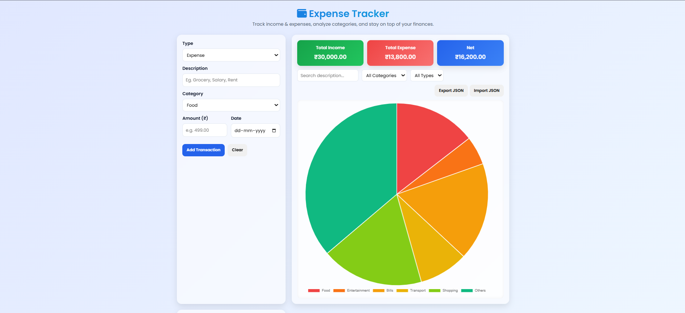
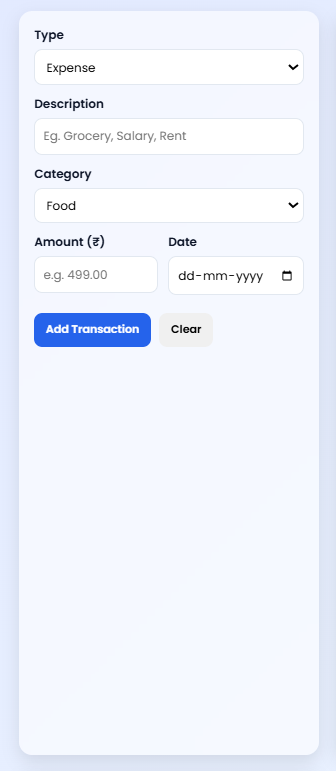
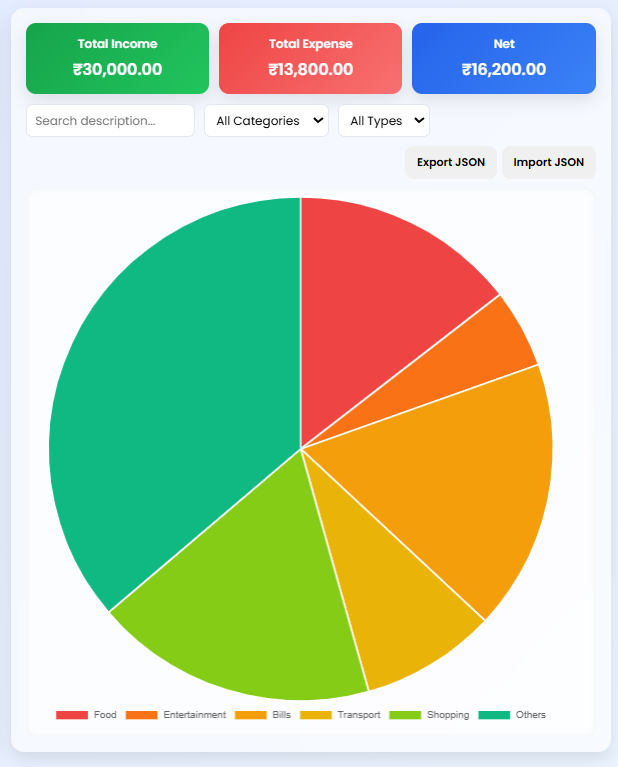

# 💰 Expense Tracker Web App

## 📘 Project Overview
The **Expense Tracker App** is a responsive and dynamic web-based application that helps users track their daily income and expenses efficiently.  
Built using **HTML, CSS, and JavaScript**, it allows users to add, edit, delete, filter, and search transactions.  
Data is stored in the browser’s **localStorage**, ensuring persistence even after page refresh.  
The app also includes a **visual pie chart** using **Chart.js** to show spending distribution by category.

---

## 🎯 Objectives
- To create an interactive and user-friendly financial tracker.  
- To implement **CRUD operations** using JavaScript.  
- To use **localStorage** for persistent data management.  
- To display **real-time summaries and charts** for better analysis.  
- To design a clean, professional, and responsive user interface.

---

## ⚙️ Technologies Used
| Technology | Purpose |
|-------------|----------|
| **HTML5** | Structure and layout |
| **CSS3** | Styling and responsiveness |
| **JavaScript (ES6)** | App logic and interactivity |
| **Local Storage** | Persistent data |
| **Chart.js** | Expense distribution chart |
| **Font Awesome** | Icons for better UI |
| **Google Fonts (Poppins)** | Typography |
| **VS Code** | Development environment |

---

## 🧠 Features
✅ Add, Edit, and Delete Transactions  
✅ Search & Filter Transactions by Category or Description  
✅ Auto-calculated **Total Income**, **Total Expense**, and **Net Balance**  
✅ Dynamic **Pie Chart** of Expense Distribution  
✅ Data stored in **Local Storage** (persists after refresh)  
✅ **Clear All** option to reset data  
✅ Fully **Responsive Design** for all devices  
✅ Interactive animations and clean UI  

---
## 🖼️ Screenshots

1. Home Page 
   

2. Transaction form 
   

3. Transaction Table
   

4. Expense chart view
   

---

## ▶️ How to run the project

- **Open directly:** double-click `index.html` to open it in your browser (no build step required).

- **Recommended (VS Code):** install the **Live Server** extension, then right-click `index.html` → _Open with Live Server_.

- **Using a simple server:**
  - Python: `python -m http.server 8000` → open http://localhost:8000
  - Node: `npx http-server` → open the printed URL (or install `http-server` globally and run `http-server`)

